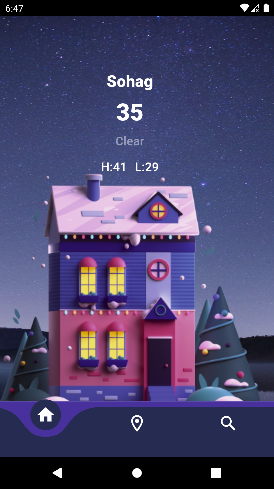
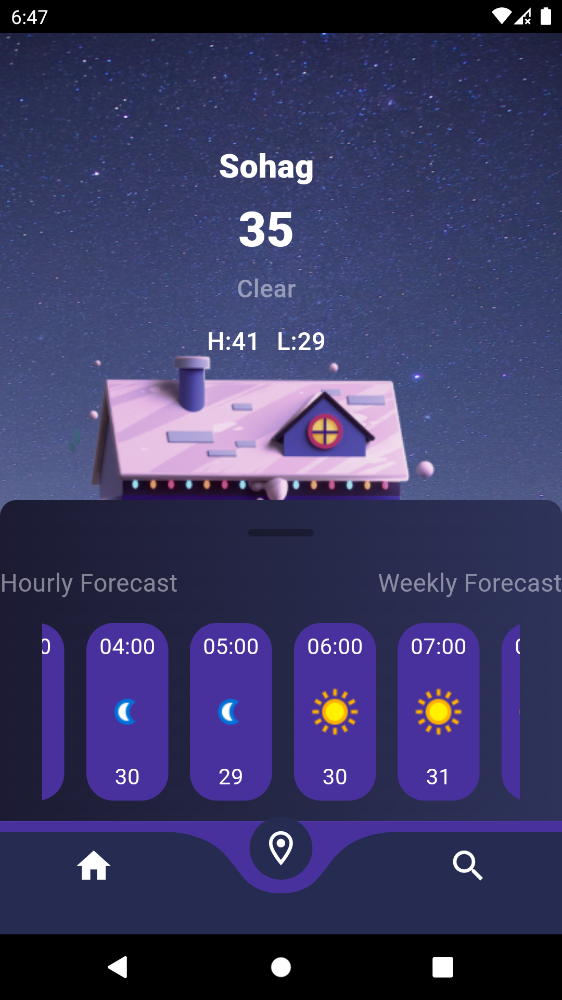

# Weather App

A Flutter application to get the current weather information.

## Features

- Current weather information
- Search by city
- Beautiful UI with real-time weather updates

## Screenshots






## Installation

To get started with this project, follow these steps:

1. **Clone the repository:**

   ```sh
   git clone https://github.com/yourusername/weather_app.git
   ```

2. **Navigate to the project directory:**

   ```sh
   cd weather_app
   ```

3. **Install dependencies:**

   ```sh
   flutter pub get
   ```

4. **Run the app:**

   ```sh
   flutter run
   ```

## Dependencies

- flutter_bloc
- Dio
- Cubit

## Usage

1. Open the app.
2. Enter the name of the city you want to get the weather information for.
3. Press the "Get Weather" button.
4. The current weather information will be displayed.

## Contributing

Contributions are welcome! Here are some ways you can contribute:

- Report bugs
- Request features
- Submit pull requests

To contribute:

1. Fork the repository
2. Create a new branch (`git checkout -b feature-branch`)
3. Make your changes
4. Commit your changes (`git commit -m 'Add some feature'`)
5. Push to the branch (`git push origin feature-branch`)
6. Open a pull request


## Contact

If you have any questions or feedback, feel free to reach out:

Email: fady46t45f@gmail.com
GitHub: Fadyemil

---

Made with ❤️ using Flutter.
